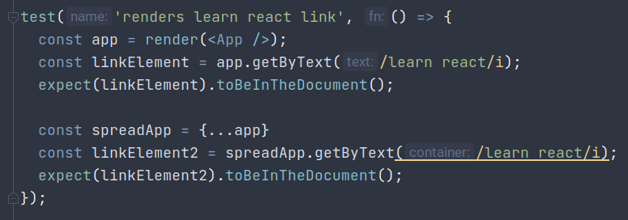

# IntelliJ JS static code analysis bug report

Code is in `App.test.js`. IntelliJ understands the signature of `app.getByText()`, but when I spread the properties 
of `app` into another object, it seems to have `.getByText()` mixed up with the wrong method and expects a different 
signature.
